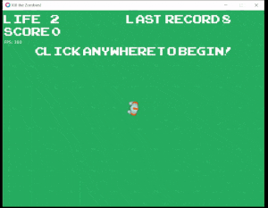

Simple project for another lesson of course 'Lua Programming and Game Development with LÖVE' (https://www.udemy.com/course/lua-love).

### In this game you control a guy using keys [WASD] and left button's mouse to shoot as many zombies as you can

## Rules:
- :triangular_flag_on_post: You have 3 lifes :heart:, you'll lose 1 life everytime a zombie touchs you :biohazard:
- :triangular_flag_on_post: You can move around screen by using keyboard's keys W A S D
- :triangular_flag_on_post: Hit zombies by click with mouse's left button :computer_mouse: :gun:

See sample below :eyes:

This game is made using löve2d and Lua, and free to use, modify and distribute under GNU General Public License v3.0 .

